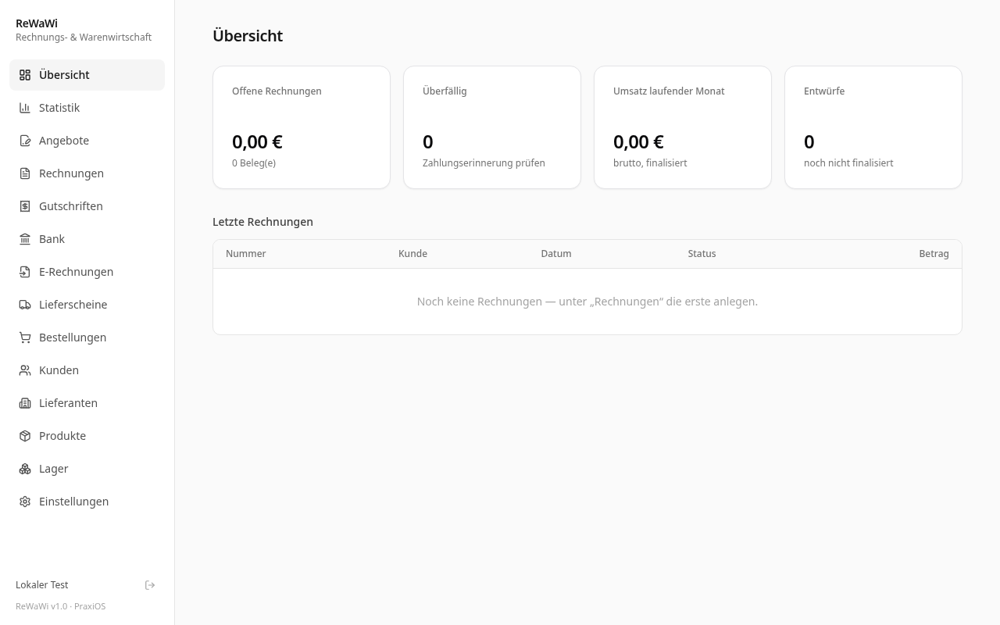
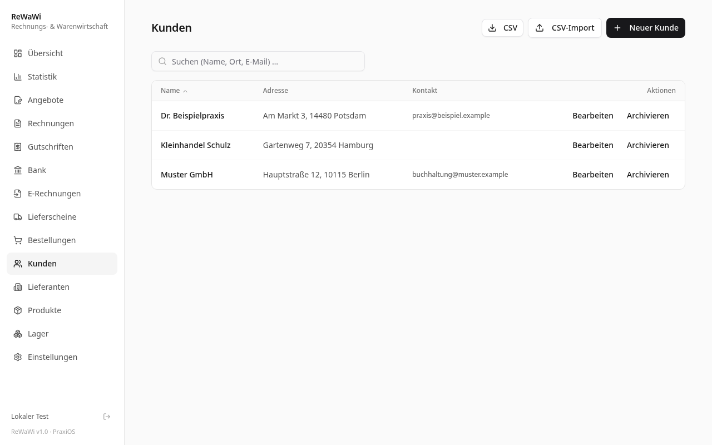
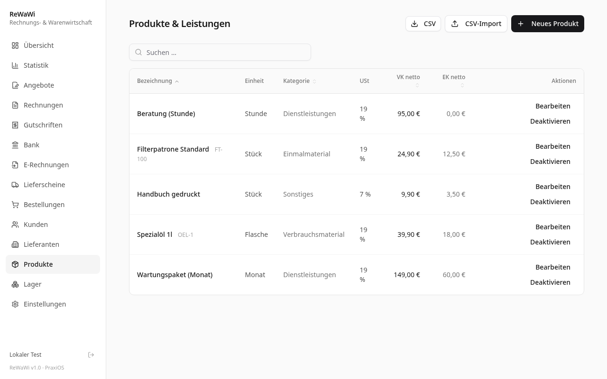

# ReWaWi — Rechnungs- & Warenwirtschaft

**Selbst gehostete Rechnungs- und Warenwirtschaft für kleine Unternehmen — GoBD-konform, DSGVO-freundlich, ohne Cloud-Zwang und ohne Abo. Teil der PraxiOS-Familie.**

*Self-hosted invoicing & inventory for German small businesses — GoBD-compliant, privacy-friendly, no cloud lock-in, no subscription.*

[](LICENSE) [](CHANGELOG.md)

---

## 🇩🇪 Deutsch

### Funktionen

**Belege & Verkauf**
- **Rechnungen** — Entwurf → Finalisierung mit lückenloser, GoBD-konformer Nummerierung; Teilzahlungen, Storno, PDF (3 Layouts + Akzentfarbe)
- **Serien-Rechnungen** — wiederkehrende Belege als Vorlage; per Klick zum Entwurf, wenn fällig
- **Angebote** — per Klick in Rechnungen umwandeln
- **Gutschriften** — eigener Nummernkreis, verrechnet mit der Originalrechnung
- **Mahnwesen** — überfällig-Filter, Mahnungen Stufe 1–3 als PDF und **per E-Mail**
- **XRechnung** — E-Rechnung als XML (EN 16931 / XRechnung 3.0, KoSIT-validiert)

**Eingang & Bank**
- **E-Rechnung-Empfang** — XRechnung-XML **und ZUGFeRD-PDF** hochladen, automatisch validieren, als Eingangsrechnung buchen (Original-XML GoBD-archiviert)
- **Kontoauszug-Import** — Bank-CSV & SumUp mit Auto-Matching auf offene Rechnungen (auch Teilzahlungen)
- **E-Mail-Versand** — Rechnungen, Angebote, Gutschriften und Mahnungen direkt per SMTP (PDF + optional XRechnung), mit Versandprotokoll

**Stammdaten & Preise**
- **Kunden, Produkte, Lieferanten** — CSV-Import/Export; EK/VK-Preise plus **Konditionen** (Sonderpreise je Partner/Produkt)
- **Lager** — Bewegungsjournal (Zugang/Abgang/Inventur), Mindestbestand, **Handy-Scanner** (Code128/PZN/DataMatrix über die Browser-Kamera), **Etiketten-Druck** als PDF für mobile Drucker
- **Preisvergleich** — erkennt gleiche Artikel aus verschiedenen Quellen und zeigt die Preisspanne
- **Altbestand-Import** — historische Rechnungen aus CSV mit Original-Nummern
- **Nutzungsnachweis-Schnittstelle** — aggregierte Verbrauchsdaten (Raum/Maschine/Material/Personal) als Rechnungsentwurf an Kooperationspartner

**Auswertung & Verwaltung**
- **Statistik** — Umsatzverlauf 12 Monate, Top-Kunden/Produkte, USt nach Satz, offene/überfällige Forderungen
- **UStVA-Hilfsblatt** — Umsatzsteuer minus Vorsteuer je Monat (Ausfüllhilfe für Mein ELSTER)
- **DATEV-Export** — Buchungsstapel (EXTF 700) für den Steuerberater
- **Benutzerverwaltung** — Rollen (Admin/Benutzer), scrypt-Passwort-Hashing, Ersteinrichtungs-Wizard
- **Mobil** — PWA: zum Startbildschirm hinzufügen, responsive UI, Kamera-Scan
- **Self-Migration** — Datenbank-Schema aktualisiert sich beim Start selbst

### Screenshots

| | |
|---|---|
|  |  |
|  |  |

### Schnellstart (Docker — empfohlen)

```bash
docker compose up --build
```

Danach http://localhost:3000 öffnen → **Ersteinrichtung** (Admin + Firmendaten).
Produktiv: eigenes DB-Passwort und `APP_SECRET` in `docker-compose.yml` bzw. `docker-compose.override.yml` setzen.

### Ohne Docker

Node.js 20+ und MySQL 8 (oder MariaDB 10.6+):

```bash
mysql -u root -p -e "CREATE DATABASE wawipros CHARACTER SET utf8mb4;"
mysql -u root -p wawipros < schema.sql
cp .env.example .env   # DATABASE_URL und APP_SECRET setzen
npm install
npm run build
npm start              # Port 3000 (PORT in .env)
```

Ausführliche Anleitungen: [`LOKAL-STARTEN.md`](LOKAL-STARTEN.md) (lokal testen) und [`SERVER-ANLEITUNG.md`](SERVER-ANLEITUNG.md) (Ubuntu-Server + Caddy + Backups + Updates per `update.sh`).

### Konfiguration

| Variable | Pflicht | Bedeutung |
|---|---|---|
| `DATABASE_URL` | ✅ | MySQL-Verbindung |
| `APP_SECRET` | ✅ | Zufallsgeheimnis für Login-Sessions (`openssl rand -hex 32`) |
| `PORT` | – | Webserver-Port (Standard: 3000) |
| `LOCAL_AUTH_BYPASS` | ⚠️ | `1` = Login überspringen — **nur für lokale Tests, niemals öffentlich!** |

SMTP-Zugang (E-Mail-Versand) wird komfortabel in der App unter Einstellungen hinterlegt (Passwort verschlüsselt gespeichert).

### Datenschutz & Rechtliches

- Rechnungsnummern lückenlos, finalisierte Belege unveränderbar (GoBD-Grundsätze). Eine **Verfahrensdokumentation** obliegt dem Betreiber — [ausfüllbare Vorlage](docs/datenschutz/Verfahrensdokumentation-Vorlage.md)
- Vor produktivem Einsatz: XRechnung-XML mit dem KoSIT-Validator prüfen, DATEV-Export mit dem Steuerberater abstimmen
- Datenschutz-Hinweise und Verarbeitungsvorlagen: [`docs/datenschutz/`](docs/datenschutz/)
- Sicherheitslücken bitte verantwortungsvoll melden: [`SECURITY.md`](SECURITY.md)

### Tech-Stack

React 19 · TypeScript · Vite · Tailwind/shadcn · Hono · tRPC 11 · Drizzle ORM · MySQL 8 · Docker

---

## 🇬🇧 English

Self-hosted invoicing & inventory for German small businesses: GoBD-compliant invoices, quotes, credit notes, dunning, XRechnung (EN 16931, validated), incoming e-invoice processing (XML + ZUGFeRD PDF), bank statement import with auto-matching, email dispatch via SMTP, customers/products/suppliers with purchase & sales prices and special terms, **stock management with phone barcode scanning and label printing**, price comparison, statistics, VAT advance-return worksheet, DATEV export, user management with roles, setup wizard, mobile PWA — all data on your own server. The UI is German (it implements German invoicing rules).

**Quick start:** `docker compose up --build` → open http://localhost:3000 → first-run wizard. Details above (German section).

---

## Lizenz & Credits

[GNU Affero General Public License v3.0](LICENSE) (AGPL-3.0). Kostenlos nutzen, verändern, weitergeben; Netzwerk-Bereitstellung erfordert Offenlegung des Quelltexts. Kommerzielle Lizenzen auf Anfrage (Dual-Licensing).

Support: best effort über GitHub Issues (ehrlich, ohne SLA). Kontakt: drawn.hunter@proton.me

*Entwickelt mit KI-Unterstützung (Kimi).*
